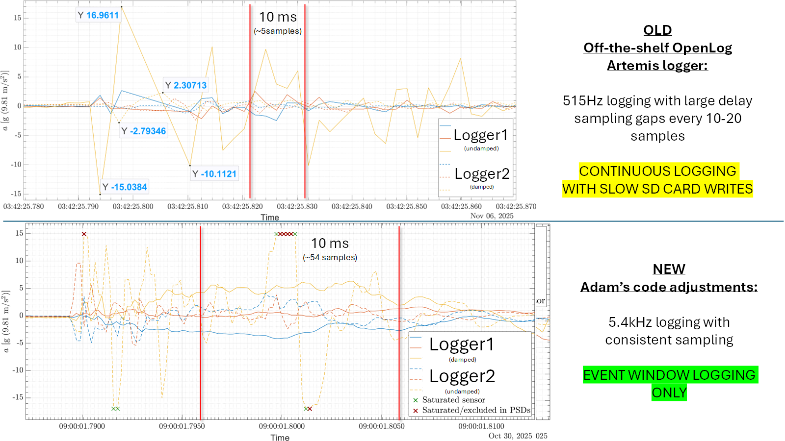
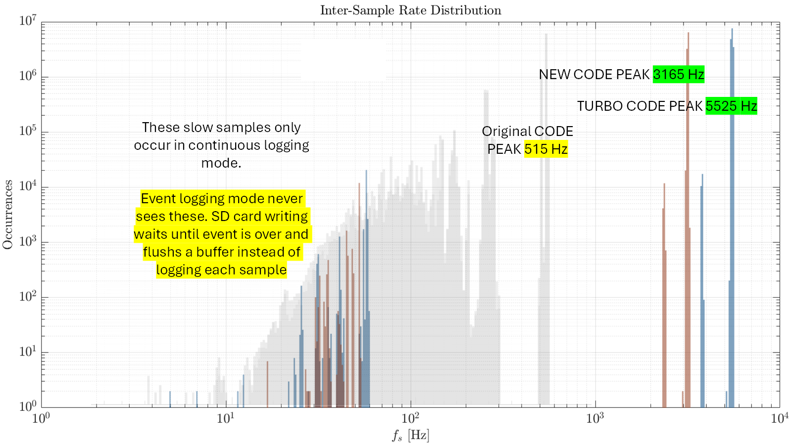
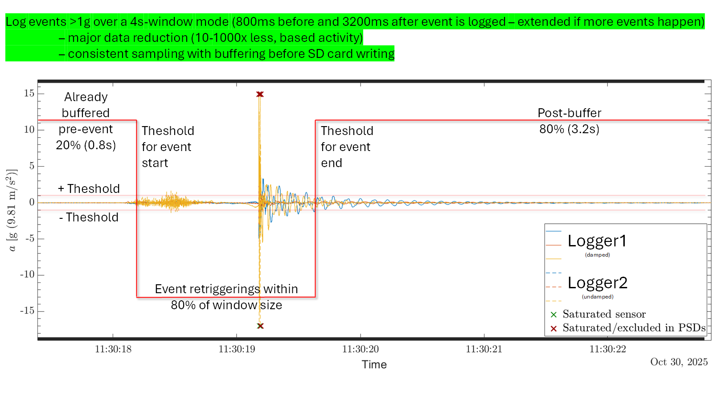
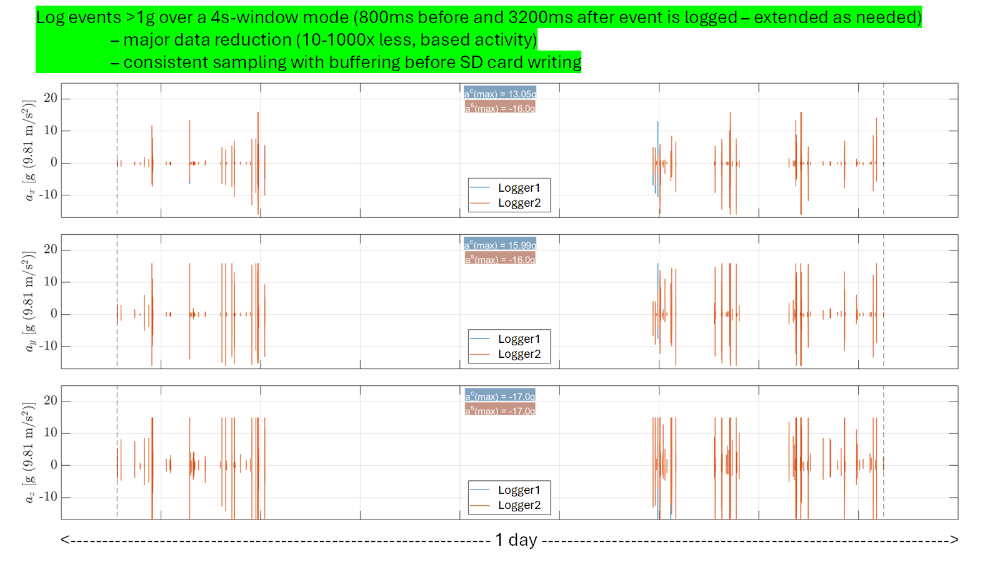
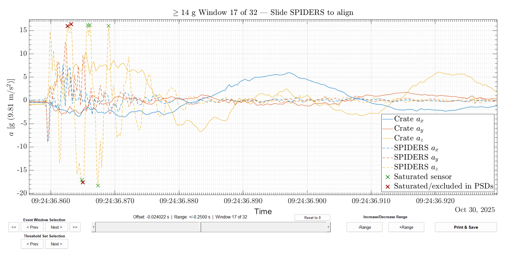

# OpenLog Artemis — Speed & Power-Optimized for the Onboard IMU (3-axis only)

Firmware that turns a SparkFun OpenLog Artemis into a **fast, power-efficient, and
consistent accelerometer logger** for shock and vibration monitoring — during shipping,
transport, or anywhere you need to catch the hard hits. It samples at several kHz while
minimizing the dropouts the stock firmware has, and — by default — only saves a short
window of data **around each shock**, so you capture the fast transient and write far less
to the SD card. Wire two units together and they capture the **same event** whenever either
one is hit.

Everything is configured from a **serial menu** (or by editing the **`OLA_settings.txt`**
file on the SD card) — no recompiling to change how it logs.

**Hardware:** SparkFun OpenLog Artemis (RedBoard Artemis ATP + onboard ICM-20948).
**Baud:** 115200.



*The off-the-shelf OpenLog Artemis logs continuously at ~515 Hz and hangs during SD-card
writes — roughly 5 samples per 10 ms. This remake samples smoothly at up to ~5.4 kHz: over
**10× the data** (~54 samples in the same 10 ms), without the stalls.*

---

## What you get over the stock logger

- **Consistent high sample rate** — ~3.2 kHz, or ~5.4 kHz with CPU burst on. Sampling only
  varies during long events, at the brief moment data is flushed to the SD card.
- **Event capture** — instead of recording everything, it saves only a window around each
  shock: **10–1000× less data**, with no SD interrupting the capture (unless event is extended).
- **Continuous capture** — a legacy mode that writes every sample straight to the card (with
  the periodic slow hangs that come with it), for when you want an unbroken record.
- **Two-logger cross-trigger** — when either unit sees a shock above its threshold, both
  record the same window, so you get matched pairs from two sensors.
- **Per-event timestamps** — every saved window is stamped with its absolute time.
- **All settings live in a serial menu** — change the sampling rate, threshold, window, filtering, 
  file rotation, LEDs, and partner mode on the fly; they're saved to the device and the SD card.



*Top sample rate climbs from **515 Hz** (stock) to **~3.2 kHz**, or **~5.4 kHz** with CPU
burst on. The slow samples on the left only occur in continuous mode (and dominated the
stock firmware) — in event mode the card is written after each window, so sampling is uniform within a window. Continuous mode still shows some slow SD activity between samples.*

---

## Getting started

1. **Flash the firmware** over USB-C (one-time Arduino setup — see
   [Install & flash](#how-to-install--flash)), with a clean, freshly formatted SD card
   inserted.
2. **Plug in** and open a serial monitor at **115200 baud**.
3. **Press any key** — the menu opens and logging pauses.
4. **Set it up** (below) following the on-screen prompts, then save and logging restarts.

Your settings are stored on both the device and the SD card, so they survive power cycles —
you configure once. 
To start logging right away with sensible defaults, just press `x`, or power up without triggering the menu.

---

## The serial menu

This is how you use the logger. Once connected, send **any character** at **115200 baud** to
open it. The menu shows the current settings, applies your changes immediately, and on exit
saves everything and resumes logging. (Prefer a text editor? The same settings live in
`OLA_settings.txt` on the card and are read at boot.)

| Key | Option | What it does |
| --- | ------ | ------------ |
| `1` | **Sampling rate** | How fast it reads the sensor. Type a rate in Hz, or **max** (the default). At max you get ~3.2 kHz, or ~5.4 kHz with CPU burst on. In event mode the floor is 20 Hz. |
| `2` | **Record events only** | The main mode switch — continuous vs. event capture. Opens a submenu (below). **Default: on.** |
| `3` | **Terminal output** | Echo the live data to the serial monitor so you can watch it. Slows logging — leave **off** for deployments. |
| `4` | **Full-scale range** | The largest acceleration the sensor can report: **±2 / ±4 / ±8 / ±16 g**. Use ±16 g (default) so hard impacts don't clip; use a smaller range for finer detail on gentle motion. |
| `5` | **Digital filter (DLPF)** | A smoothing low-pass filter in the sensor. **Off** (default) gives full bandwidth and the highest rate; **on** smooths the signal (set the cutoff with option 6). |
| `6` | **DLPF bandwidth** | When the filter is on, its cutoff: ~246, 111, 50, 24, 12, 6, or 473 Hz. Lower = more smoothing. (Turn the filter on with option 5 first.) |
| `7` | **File rotation** | Automatically start a new file after a set **time** and/or **file size** (below). |
| `8` | **LED mode** | How much the lights blink (below). |
| `9` | **CPU speed (burst)** | **On** (default) = 96 MHz, ~2× the sample rate (and ~2× power). **Off** = 48 MHz, lower power. |
| `r` | **Reset to defaults** | Restore all settings. |
| `x` | **Save & resume** | Save and start logging. |

### Option 2 — event capture submenu

With **Record events only = ON**, the logger keeps a short rolling history and start storing a
window of data each time a shock crosses your threshold, then flushes it to the SD card once
activity drops back below the threshold and the window closes. The submenu lets you tune it:

| Key | Setting | What you enter |
| --- | ------- | -------------- |
| `w` | **Window length** | Total span saved per event, in **milliseconds** (e.g. `4000` = 4 s). Minimum a few ms; maximum is the device's buffer span, shown in the menu (up to ~7 seconds at 5.4kHz). **Default: 3000 ms.** |
| `g` | **Trigger threshold** | In **mg** (thousandths of a g) — how far from rest the acceleration must jump to start a capture. It's the combined magnitude across all three axes, high-pass filtered to remove steady biases like gravity. **Default: 1000 mg.** Range from a fraction of a g up to 16 g. |
| `s` | **Pre/post split** | How much of the window is captured **before** the trigger vs. after, entered as the pre-event %. `20` = 20% before / 80% after (default); `50` = even split. Range 2–98%. |
| `p` | **Partner trigger** | **AUTO** (default) or **OFF** — see [Two-logger partner mode](#two-logger-partner-mode). |
| `x` | Back | Return to the main menu. |

### Option 7 — file rotation

- **Time:** start a new file every N **days** (1 minute minimum (0.000694 days), 7 days max).
- **Size:** start a new file every N **GB** (e.g. `1` = 1 GB, `0.2` = 200 MB; 25 KB minimum, 3.8 GB max).

Files never split in the middle of an event.

### Option 8 — LED modes

- **0** — Power LED on; flashes on every write.
- **1** — Low-power heartbeat: one blip every 15 s.
- **2** — Flash only after an event *(default)*.
- **3** — Lights off entirely (lowest power).

---

## Event mode & triggers

Event mode is the default and part of the reason to use this firmware. Instead of recording
continuously, it watches for shocks and saves just the part that matters:



*One captured event. Because the logger keeps a rolling history, the saved window includes
the **lead-up before the trigger** (the pre-split, default 20%) as well as the
**aftermath** (default 80%). If more shocks land inside the tail of the window, it
**extends** so you always get quiet after the last one. Samples that hit the sensor's
full-scale limit are flagged for analysis. Shown configured to a 4 s window: 800 ms before + 3.2 s after.*

If an event runs long enough to fill the rolling buffer, the logger flushes it to the SD card and resumes as fast as it can — a single pause of ~2 s at 48 MHz or ~1 s at 96 MHz — then keeps capturing in a fresh chunk. That flush is the price of gap-free sampling across a large buffer: it holds ~7 s at 5.4 kHz or ~12 s at 3.2 kHz (slower sampling fits more time), while the flush duration stays fixed. An event that lands during the flush can be missed, but logging will trigger as soon as it can to catch the tail of the event window.

In plain terms:

- **You set the threshold in g** (option 2 → `g`). A capture starts when the absolute
  acceleration magnitude deviates from its resting value by more than the **threshold** — so
  it fires on real motion, not on the constant pull of gravity or the slow sway of a boat.
- **You set the window length and the before/after split** (option 2 → `w` and `s`).
- For the first couple of seconds after startup, the logger ignores **its own**
  threshold while the gravity-removal settles, so startup motion can't false-trigger a
  capture. (When two units pair, both also hold off for about 5 seconds so neither one jumps
  the gun — see partner mode.)
- The result is a handful of clean, time-stamped windows instead of a giant continuous file:



*A full day from two loggers in event mode — the whole day collapses to a few short windows
around the shocks. That's the 10–1000× data reduction compared to continuous logging. Peak
accelerations from both units are noted on each axis.*

---

## Two-logger partner mode

Run two loggers together and have them capture the **same event** whenever **either** one is
hit — ideal for comparing two locations or two sensors on the same impact (for example, one
logger on a crate floor and one on the sensitive equipment resting on dampers above it).

**Wiring** — three wires, no extra parts:

```
   Logger A                          Logger B
   TRIG_OUT (pin 32) ───────────▶  TRIG_IN  (pin 11)
   TRIG_IN  (pin 11) ◀───────────  TRIG_OUT (pin 32)
   GND               ────────────  GND
```

**Using it:** set **Partner trigger = AUTO** on both units (option 2 → `p`; it's the
default). That's it — when one logger triggers, the other records the same window, and the
saved window covers the full span either one was active.

**They pair themselves — no buttons.** Pairing happens automatically whether both units power
on together, or you plug the second one in while the first is already logging. Here's what
you'll see, and how to confirm they're synced:

```
  power on, or plug in the second unit
        │
        ▼
  they find each other  ──▶  quick BLUE flash on both   (paired)
        │
        ▼
  ~5 seconds, no logging yet
        │
        ▼
  one low-power flash on both, nearly together   (synced — ready)
        │
        ▼
  normal event logging
```

(A unit you've just plugged in flashes once it has finished powering up.) That final
synchronized flash is your confirmation: both units paired, agreed on a common timeline
(to ~1 ms), and started logging together. From then on, captures from the two units line up
in time.

**A note on clocks.** The two loggers run on independent clocks that drift — over days or
weeks their absolute timestamps can diverge by hours. The synchronized start is what makes
the data usable: because both begin together and capture the same events in real time, you can
align the two records by their shared **start and end** points (and the common events
between). Once lined up at both ends, any leftover offset is just timing jitter.

For a **single logger**, set **Partner trigger = OFF** (or just leave it on AUTO — with
nothing wired it simply never finds a partner; AUTO never blocks, waits, or reduces sampling rate).

---

## Your data (the log files)

Log files are plain comma-separated values (CSV) saved as `.TXT` text files (named
`dataLogNNNNN.TXT`), each with the header `micros,aX,aY,aZ`.

- **Acceleration** (the `aX/aY/aZ` columns) is in **milli-g ×100**: divide by **100** for
  mg, or by **100,000** for g. The full range is ±1,600,000 (= ±16 g). This integer
  convention avoids floating-point math — keeping sampling fast, saving memory, and dropping
  a character per value.
- **Continuous mode:** one row per sample; the first column is an absolute microsecond
  timestamp from the logger's internal clock.
- **Event mode:** each saved window begins with a `DAY:` line — the absolute time of that
  window's first sample, as a **decimal day** (12 decimals) counted from when logging started
  (and reset whenever a partner pairs). Inside a window the first column is a microsecond
  offset that starts at 0 and rolls over at 65536. To rebuild absolute time, add up the
  offsets (adding 65536 each time the number drops) and add that to the `DAY` value.

**Continuous mode:**
```
micros,aX,aY,aZ
1544841,10279,1298,-10982    (first column is absolute microseconds)
1545141,10081,1001,-10790
...                          (one row per sample)
```

**Event mode:**
```
micros,aX,aY,aZ
DAY: 0.123456789012
0,10279,1298,-10982          (offset resets to 0 at each window start)
204,10281,1301,-10979
...                          (rest of the captured window)
DAY: 1.622131298745          (next captured window)
0,13279,1448,-105682
...                          (rest of the captured window)
```

For example, `98100` in an acceleration column is 981.00 mg = **0.981 g**.

---

## How to install & flash

1. **Add the board core.** In the Arduino IDE, open *Preferences → Additional Boards Manager
   URLs* and add:
   ```
   https://raw.githubusercontent.com/sparkfun/Arduino_Apollo3/main/package_sparkfun_apollo3_index.json
   ```
   Then *Tools → Board → Boards Manager* → install **SparkFun Apollo3**, and select the board
   **RedBoard Artemis ATP**.
2. **Add the libraries** (*Tools → Manage Libraries*):
   - **SparkFun 9DoF IMU Breakout - ICM 20948**
   - **SdFat** by Bill Greiman (v2.x)
3. **Open the sketch** — open `OLA_Accel_Logger/OLA_Accel_Logger.ino` (keep both files in
   that folder together).
4. **Upload**, then open the serial monitor at **115200** and press any key for the menu.

---

## Repository layout

```
.
├── OLA_Accel_Logger/      # the firmware — open the .ino in Arduino
├── docs/images/           # the figures in this README
├── LICENSE
└── README.md
```

---

## Companion analysis



*Captured windows can be reviewed in Excel, or in any tool that can plot and overlay the two
loggers (MATLAB, Python, etc.). The MATLAB analysis package shown here steps through each
event, aligns the two records, and flags saturated samples; it reads the `.TXT` files
directly. (Not part of this firmware package yet — in the works.)*

---

## License

Released under **Creative Commons Attribution-NonCommercial 4.0 (CC BY-NC 4.0)** — see
[`LICENSE`](LICENSE). You're free to use, share, remix, and build on it **with attribution,
for non-commercial purposes** (no commercial use or resale).

Based on SparkFun's [OpenLog Artemis](https://github.com/sparkfun/OpenLog_Artemis); see
[`NOTICE`](NOTICE) for attribution. Not legal advice.
